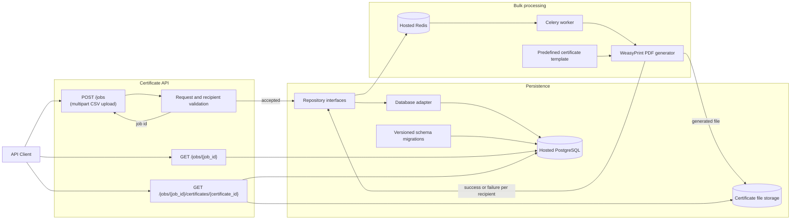

# Bulk Certificate Generator

Backend API for submitting bulk certificate-generation jobs, tracking their
progress, and retrieving generated certificates.

## Implementation decisions

- **Framework:** FastAPI is the planned API framework.
- **Database:** Hosted PostgreSQL is the relational database.
- **Queue:** Hosted Redis is the broker/backend for Celery background jobs.
- **Certificate format:** PDF certificates are rendered from the single
  predefined HTML/CSS template using WeasyPrint.
- **Input:** `POST /jobs` accepts one CSV file containing the recipient list
  plus certificate-level form fields.
- **Processing:** Jobs are processed asynchronously so the request returns
  quickly for large batches and the client can track progress.
- **Template:** Every certificate uses one predefined template; a template
  editor and multiple designs are intentionally out of scope.
- **Failure isolation:** Each recipient is processed independently. A
  generation failure is recorded for that recipient without preventing other
  valid recipients from completing.
- **Persistence:** A relational database stores jobs, recipients, statuses,
  and result metadata. Certificate files are stored separately through a
  storage interface.

## Setup

### Requirements

- Python 3.12 or newer
- Hosted PostgreSQL
- Hosted Redis
- Local filesystem storage
- WeasyPrint and its platform-specific rendering dependencies
- [uv](https://docs.astral.sh/uv/)

### Install

```powershell
uv sync --dev
```

Copy `.env.example` to `.env` and replace the placeholder service values:

```powershell
Copy-Item .env.example .env
```

WeasyPrint renders the predefined HTML/CSS certificate template to PDF. Follow
the WeasyPrint installation instructions for the target operating system if
native rendering libraries are required.

Create the local environment configuration from the project template and set
the hosted PostgreSQL, Redis, and storage values before starting the
application. Never commit secrets or production credentials.

Example configuration:

```env
DATABASE_URL=postgresql+asyncpg://<user>:<password>@<postgres-host>:5432/<database>
REDIS_URL=rediss://default:<password>@<redis-host>:6379
STORAGE_PATH=storage
```

Generated certificates are stored in the local `storage/` directory. The
storage interface remains separate from the API and worker so a third-party
provider can be added later without changing certificate-generation logic.
Generated certificates should use generated storage keys; never use a
user-supplied filename or path.

## Run the application

Apply database migrations, then start the API and background worker:

```powershell
uv run uvicorn app.main:app --reload
uv run celery -A app.worker.celery_app worker --loglevel=INFO
```

The API entry point is `app.main:app`. The Celery worker and migration modules
will be added in later phases. For Phase 1, verify the API foundation with:

```powershell
uv run uvicorn app.main:app --reload
```

The API exposes `/health` and interactive OpenAPI documentation at `/docs`.
Run migrations using the configured migration tool once the database phase is
implemented. For example:

```powershell
uv run alembic upgrade head
```

The API should expose interactive OpenAPI documentation at `/docs` when
running locally.

## Run tests

Run the complete test suite with:

```powershell
uv run python -m pytest
```

Phase 1 includes a health endpoint smoke test. The complete suite will add
job creation, input validation, certificate generation, job status/progress,
individual certificate failure, and certificate retrieval tests in later
phases.

## Phase 2 database

Set `DATABASE_URL`, then run the first migration:

```powershell
uv run alembic upgrade head
```

Phase 2 stores jobs, recipients, and generated certificate file keys in
PostgreSQL. PDF files remain in the local `storage/` directory.

## API architecture

The API is designed around asynchronous job processing. A request creates a
job and returns its identifier immediately; individual recipients are then
processed independently so one certificate failure does not stop the rest of
the batch.



The API publishes jobs to hosted Redis through Celery. A Celery worker
consumes each job, renders the predefined HTML/CSS template with WeasyPrint,
records per-recipient results in PostgreSQL, and writes generated PDFs to the
private local `storage/` directory.

### CSV upload input

The client provides the recipient list as a CSV file using a multipart
`POST /jobs` request. Certificate-level fields are sent as form fields, while
the `recipients_file` field contains the CSV upload.

```http
POST /jobs
Authorization: Bearer <access-token>
Content-Type: multipart/form-data
```

Example form fields:

```text
certificate_title=Certificate of Completion
course_name=Advanced Python Programming
organization_name=Acme Learning
issue_date=2026-10-07
recipients_file=recipients.csv
```

The CSV must contain a header row with these columns:

```csv
full_name,email,certificate_number
Aarav Sharma,aarav.sharma@example.com,PY-2026-0001
Priya Patel,priya.patel@example.com,PY-2026-0002
```

`full_name` is required. `email` and `certificate_number` are recommended,
and certificate numbers must be unique within a job when provided. The API
should validate the file type, encoding, headers, row count, field lengths,
email values, duplicate rows, and configured file-size and recipient-count
limits before placing the job on the queue. Invalid rows should be reported
with row numbers; valid rows may continue processing according to the job
validation policy.

The endpoint returns a job identifier immediately:

```json
{
  "job_id": "0f7f9f7b-ef37-4e7a-8845-f3b4a8c7a9c1",
  "status": "queued",
  "total_recipients": 2,
  "status_url": "/jobs/0f7f9f7b-ef37-4e7a-8845-f3b4a8c7a9c1"
}
```

### Request flow

1. The client submits certificate metadata and a CSV file to `POST /jobs`.
2. The API validates the form fields and parses the CSV, creates a job record,
   and queues the work.
3. A background worker generates certificates independently for each valid
   recipient using the predefined template.
4. The worker records each recipient's success or failure and updates job
   progress in the relational database.
5. The client polls `GET /jobs/{job_id}` for progress and uses the certificate
   download endpoint for successful outputs.

## Retrieve generated certificates

Poll the returned status URL:

```http
GET /jobs/{job_id}
Authorization: Bearer <access-token>
```

The response should include the job status, total, completed, successful, and
failed counts, plus per-recipient results. Successful results include the
certificate download endpoint:

```json
{
  "job_id": "0f7f9f7b-ef37-4e7a-8845-f3b4a8c7a9c1",
  "status": "completed",
  "total_recipients": 2,
  "successful": 1,
  "failed": 1,
  "results": [
    {
      "certificate_number": "PY-2026-0001",
      "status": "completed",
      "certificate_id": "certificate-id-1"
    },
    {
      "certificate_number": "PY-2026-0002",
      "status": "failed",
      "error_code": "GENERATION_FAILED"
    }
  ]
}
```

```http
GET /jobs/{job_id}/certificates/{certificate_id}
Authorization: Bearer <access-token>
```

Only successfully generated certificates are downloadable. Failed recipients
remain visible in the job result with a safe error code and message.

## Database portability and migrations

Database access should remain behind the repository interfaces and a
database-adapter boundary. API handlers and background workers must not contain
database-specific SQL or depend directly on a database driver's types. This
allows the adapter to be replaced when moving between supported relational
databases without changing the API or certificate-generation code.

The schema should be managed using versioned migrations rather than manual
database changes. Each migration must be repeatable in a fresh environment and
must include a rollback strategy where the migration tool supports it. Keep
these concerns separate:

- **Domain data:** jobs, recipients, and per-recipient generation results are
  stored through repositories.
- **Generated files:** certificate binaries are stored in the private local
  filesystem;
  the database stores only their stable storage key and metadata.
- **Schema history:** migration metadata records which schema versions have
  been applied.

### Moving to another database

1. Provision the target relational database.
2. Run the complete migration history against the target.
3. Export the domain tables from the source and import them through a
   database-neutral data migration or the repository layer.
4. Copy the local certificate files and preserve their storage keys.
5. Configure the new database connection and storage location.
6. Run consistency checks for job counts, recipient results, and file keys
   before switching API traffic.

Using stable UUIDs for job and certificate identifiers, ISO-8601 timestamps,
explicit status values, and portable column types further reduces vendor
coupling during a migration.